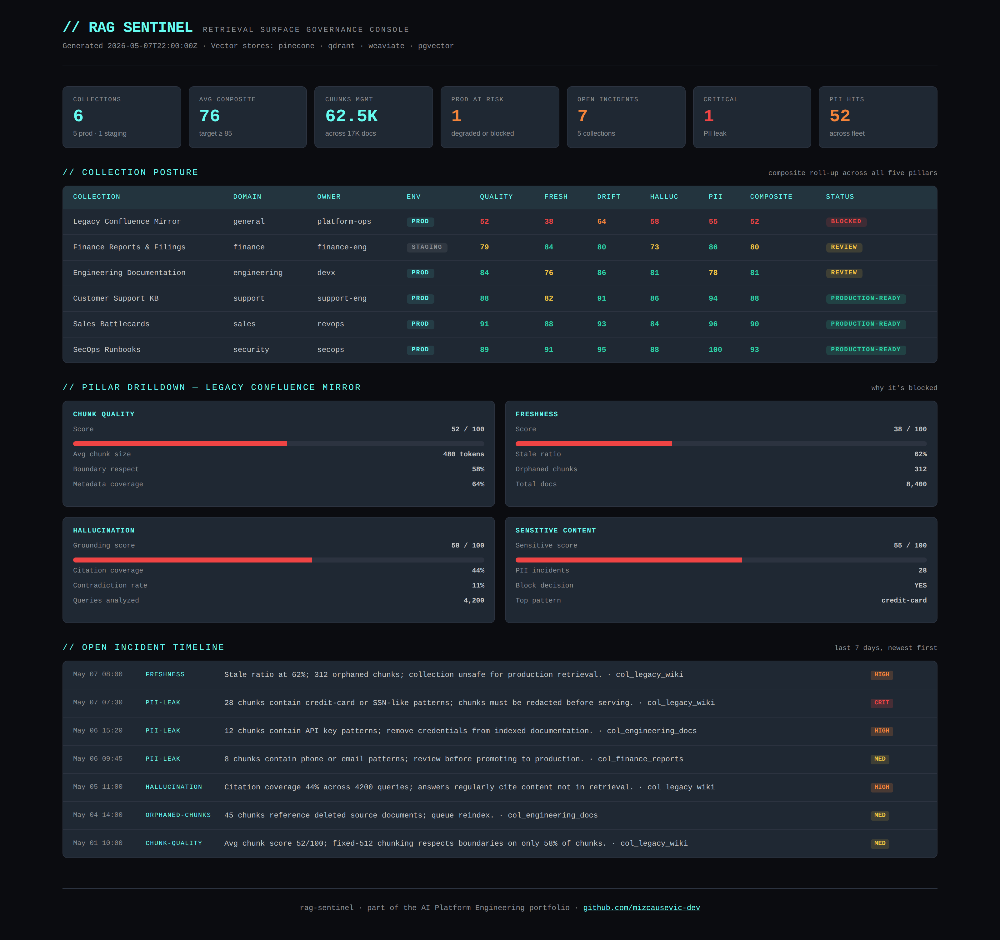

# RAG Sentinel

[](https://github.com/mizcausevic-dev/rag-sentinel/actions/workflows/ci.yml)
[](https://nodejs.org)
[](https://www.typescriptlang.org)
[](LICENSE)

Governance and observability layer for **enterprise RAG systems** — chunk quality scoring, source freshness audits, retrieval drift detection, hallucination signals, and PII leakage scanning across every collection your platform indexes.

> Recruiter takeaway:
>
> *"This person is solving the part of enterprise RAG that everyone ships and nobody monitors. The retrieval surface needs the same governance discipline as the tool surface — and they actually built it."*

## Why This Exists

Most enterprise AI failures aren't model failures — they're **retrieval failures**. Stale documentation that contradicts current product behavior. Chunks that start mid-sentence and degrade relevance. API keys accidentally indexed into the vector store. Top-K results silently shifting after an embedding model upgrade. None of this is visible until a customer sees something wrong in production.

RAG Sentinel is the layer that watches all of it. It scores chunks at index time, audits sources for staleness, detects retrieval drift across snapshots, evaluates answer grounding, and scans indexed content for PII. Output is operator-friendly: per-collection posture scores, blocked-content lists, top issues by frequency, and a Monday-morning dashboard that fits on one screen.

## Where This Sits in the Portfolio

| Repo | Surface | Question it answers |
|---|---|---|
| [`mcp-sentinel`](https://github.com/mizcausevic-dev/mcp-sentinel) | Tool calls | *What MCP tools are exposed and how risky are they?* |
| **`rag-sentinel`** | **Retrieval** | ***What's in the vector store and how trustworthy is it?*** |
| [`agent-codex`](https://github.com/mizcausevic-dev/agent-codex) | Decisions | *Under what policies are decisions allowed?* |
| [`agentobserve`](https://github.com/mizcausevic-dev/agentobserve) | Runtime | *What did agents actually do — cost, latency, outcomes?* |
| [`kinetic-flightdeck`](https://github.com/mizcausevic-dev/kinetic-flightdeck) | Operator | *Are we OK right now? Who do I call?* |

## Project Overview

| Attribute | Detail |
|---|---|
| Runtime | Node.js + TypeScript |
| Framework | Express 5 |
| Domain | Enterprise RAG governance and observability |
| Validation Areas | Chunk quality · Source freshness · Retrieval drift · Hallucination signals · PII/sensitive content |
| Operational Outputs | Per-chunk scores · Per-collection posture · Drift comparisons · Blocked-content lists · Open-incident view |
| Docs | OpenAPI spec embedded; routes self-documented |

## Five Governance Pillars

### 1. Chunk Quality Scoring

Bad chunks lead to bad retrievals. Scored at index time:
- Token count posture (too small loses context, too large exceeds embedding context)
- Sentence boundary respect (chunks should not start/end mid-sentence)
- Metadata completeness (source, title, last_updated minimum)
- Boilerplate detection (low lexical diversity flagged)
- Empty/whitespace content protection

### 2. Source Freshness Audit

Stale RAG content is the silent killer. Bucket distribution + weighted score:
- `fresh` (≤30 days, weight 100)
- `aging` (31–90 days, weight 75)
- `stale` (91–365 days, weight 30)
- `ancient` (>365 days, weight 0)

### 3. Retrieval Drift Detection

Same query returning different results over time. Compares two retrieval snapshots:
- Top-K overlap ratio
- Spearman-style rank correlation
- New / dropped chunk identification
- Embedding-model-change detection (drift expected, validation required)

Drift levels: `minimal` · `moderate` · `significant` · `severe`

### 4. Hallucination Signals

Heuristic grounding analysis on RAG answers:
- Citation coverage (% of substantive claims with attribution)
- Source-claim alignment (do quoted snippets actually appear in retrieved sources?)
- Ungrounded number/date generation
- Refusal recognition (refusing with no relevant sources is a positive signal)
- Empty-retrieval-with-non-empty-answer guard

### 5. PII / Sensitive Content Scanning

Catches leakage before it ends up in retrieval results:
- Private key blocks (PEM)
- API/secret key prefixes (sk-, pk-, sk-proj-, etc)
- AWS access keys (AKIA pattern)
- JWT tokens
- SSN, credit card, IBAN
- Emails and US phone (low-severity awareness)

Severity-weighted blocking decision: `critical` and `high` hits trigger automatic block.

## Composite Posture Methodology

| Pillar | Weight | Rationale |
|---|---|---|
| Sensitive content | 0.25 | Leakage is binary; one critical hit blocks |
| Hallucination | 0.25 | Grounding is the user-facing trust contract |
| Freshness | 0.20 | Stale content silently degrades retrieval |
| Chunk quality | 0.15 | Index-time investment |
| Retrieval drift | 0.15 | Detected stability of the surface |

Override logic: a single critical signal (PII crisis, freshness crisis, hallucination crisis) **forces blocked status** regardless of composite — the same "platform thinking" doctrine used in `mcp-sentinel` and `kinetic-flightdeck`.

## API Endpoints

### Read

| Method | Endpoint | Purpose |
|---|---|---|
| GET | `/health` | Service status and uptime |
| GET | `/api/collections` | List registered RAG collections |
| GET | `/api/collections/:id` | Single collection metadata + metrics |
| GET | `/api/collections/:id/posture` | Composite posture score for collection |
| GET | `/api/incidents` | Filtered incident feed (collectionId, severity, status, category) |
| GET | `/api/dashboard/summary` | Operator headline view |

### Validate

| Method | Endpoint | Purpose |
|---|---|---|
| POST | `/api/validate/chunks` | Score a batch of chunks at index time |
| POST | `/api/validate/freshness` | Audit a collection's source freshness |
| POST | `/api/validate/drift` | Compare two retrieval snapshots |
| POST | `/api/validate/answer` | Evaluate an answer for hallucination signals |
| POST | `/api/validate/pii-scan` | Scan a chunk batch for sensitive content |

## Sample: Hallucination Evaluation

```json
POST /api/validate/answer
{
  "answerText": "The system uses Diffie-Hellman key exchange. This was confirmed in the 2024 audit.",
  "citationsClaimed": [
    { "sourceId": "s1", "quote": "Diffie-Hellman key exchange used since 2019" }
  ],
  "retrievedSources": [
    { "sourceId": "s1", "text": "The cryptographic stack uses RSA-2048 for transport." }
  ]
}
```

```json
{
  "groundingScore": 25,
  "citationCoverage": 50,
  "signals": [
    "1 citation(s) reference content not in retrieved sources.",
    "1 numeric/date claim(s) not present in retrieved sources: 2024."
  ],
  "unsupportedCitations": [
    { "sourceId": "s1", "quote": "Diffie-Hellman key exchange used since 2019" }
  ],
  "recommendedNextAction": "Block answer from production output; investigate retrieval quality and prompt grounding instructions."
}
```

## Sample: PII Scan

```json
POST /api/validate/pii-scan
{
  "chunks": [
    { "chunkId": "c_429", "text": "Use sk-proj-AbCdEf1234567890XyZpQrStUvWxYz123456 to authenticate." }
  ]
}
```

```json
{
  "totalChunks": 1,
  "flaggedChunks": 1,
  "blockedChunks": 1,
  "hitsBySeverity": { "critical": 1, "high": 0, "medium": 0, "low": 0 },
  "hitsByPattern": { "api-key-prefix": 1 },
  "perChunk": [
    {
      "chunkId": "c_429",
      "hits": [
        {
          "patternName": "api-key-prefix",
          "severity": "critical",
          "description": "API/secret key with conventional prefix detected.",
          "matchedSnippet": "sk-p****56"
        }
      ],
      "highestSeverity": "critical",
      "shouldBlock": true
    }
  ]
}
```

## Operator Console Preview



## Getting Started

### Prerequisites

- Node.js 20+
- npm

### Setup

```bash
git clone https://github.com/mizcausevic-dev/rag-sentinel.git
cd rag-sentinel
npm install
npm run dev
```

Visit:

- `http://localhost:3000/health`
- `http://localhost:3000/api/dashboard/summary`
- `http://localhost:3000/api/collections`

### Run Tests

```bash
npm test
```

35 unit tests covering chunk quality, freshness buckets, retrieval drift edge cases, hallucination heuristics, PII pattern coverage, and composite posture override logic.

## What This Demonstrates

- RAG governance translated into enforceable, testable backend rules
- Heuristic-but-defensible analysis of grounding without requiring LLM calls in the loop
- Composite scoring that respects platform-engineering doctrine (sensitive content + hallucination dominate)
- Override logic — a single critical signal blocks regardless of good composites
- Pluggable validation endpoints designed to wire into indexing pipelines and answer pipelines
- Strict-mode TypeScript with full test coverage; CI matrix on Node 20 + 22

## Future Enhancements

- Real-time polling agent for vector stores (Pinecone, Qdrant, Weaviate, pgvector)
- LLM-based grounding cross-check (heuristics + judge model)
- Streaming chunk validation for ingestion pipelines
- Per-collection scoring history with PostgreSQL + Grafana
- Alert routing to PagerDuty, Slack, and SIEMs
- Multi-tenant control plane for managed-service deployment

## Tech Stack

- Node.js, TypeScript, Express, Zod
- Helmet, CORS, Morgan
- Node test runner

## Portfolio Links

- [LinkedIn](https://www.linkedin.com/in/mizcausevic/)
- [Skills Page](https://mizcausevic.com/skills)
- [Medium](https://medium.com/@mizcausevic)
- [GitHub](https://github.com/mizcausevic-dev)

Part of [mizcausevic-dev's GitHub portfolio](https://github.com/mizcausevic-dev) — AI Platform Engineering quintet.

---

**Connect:** [LinkedIn](https://www.linkedin.com/in/mirzacausevic/) · [Kinetic Gain](https://kineticgain.com) · [Medium](https://medium.com/@mizcausevic/) · [Skills](https://mizcausevic.com/skills/)
